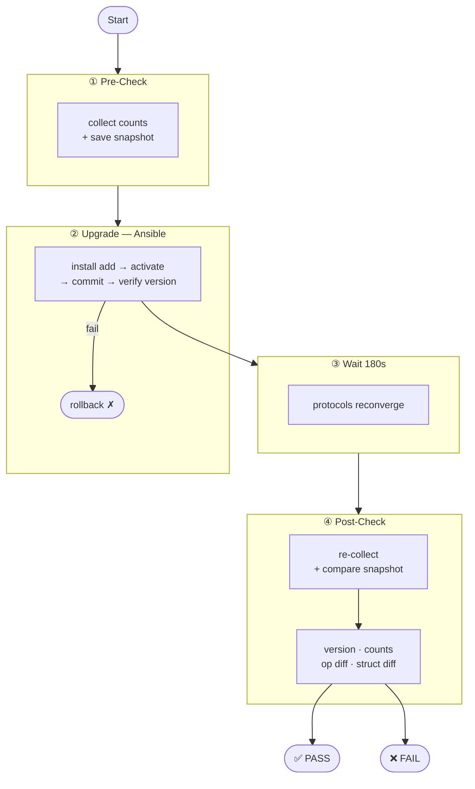

# iosxr-upgrade-automation

Automates Cisco IOS-XR upgrades with structured pre/post health validation.

- **Ansible** (`playbooks/upgrade_iosxr.yml`) — runs the upgrade (install add → activate → commit)
- **pyATS / Genie** (`pyats/pre_check.py` / `pyats/post_check.py`) — captures device state before and after, compares, pass/fail

All checks are configured in `pyats/checks.yaml`. No Python changes needed to add or remove checks.

---

## Workflow



---

## Project Structure

```
iosxr-upgrade-automation/
├── playbooks/
│   └── upgrade_iosxr.yml         # Ansible upgrade playbook
├── pyats/
│   ├── testbed.yaml              # Device topology (IPs, OS, credentials)
│   ├── checks.yaml               # ← Edit this to add/remove checks
│   ├── checks_lib.py             # Shared library (collection, diff, count logic)
│   ├── pre_check.py              # Collect + save pre-upgrade snapshot
│   └── post_check.py             # Compare snapshot, produce pass/fail report
├── collections/
│   └── requirements.yml          # Ansible Galaxy dependencies
├── snapshots/                    # Auto-created; stores JSON snapshots
├── ansible.cfg
├── inventory.ini
├── requirements.txt
├── run_upgrade.sh                # One-shot orchestration script
└── .gitignore
```

---

## Quick Start

### 1. Install dependencies

```bash
pip install -r requirements.txt
ansible-galaxy collection install -r collections/requirements.yml
```

### 2. Set credentials

```bash
export NET_USERNAME=admin
export NET_PASSWORD=yourpassword
```

### 3. Configure devices

**`pyats/testbed.yaml`** — one entry per router:
```yaml
devices:
  router-1:
    os:       iosxr
    platform: ncs5500
    connections:
      cli:
        protocol: ssh
        ip:       192.168.1.1
```

**`inventory.ini`** — mirror the same devices:
```ini
[iosxr_routers]
router-1  ansible_host=192.168.1.1
```

### 4. Run the upgrade

```bash
# Full end-to-end (recommended) — NCS 5500 upgrade from 24.2.1 → 25.2.1
./run_upgrade.sh \
  -t 25.2.1 \
  -s "sftp://mgmt-server.local/images/ncs5500-x64-25.2.1.iso" \
  -f "ncs5500-x64-25.2.1.iso"
```

| Flag | Description | Default |
|------|-------------|---------|
| `-t` | Target IOS-XR version | *(required)* |
| `-s` | Image source URI | *(required)* |
| `-f` | Image filename | *(required)* |
| `-b` | Path to testbed.yaml | `./pyats/testbed.yaml` |
| `-i` | Path to inventory | `./inventory.ini` |
| `-d` | Snapshot directory | `./snapshots` |
| `-w` | Convergence wait (seconds) | `180` |
| `-n` | Limit to devices (comma-separated) | all |

---

## Running phases independently

```bash
# Step 1 — before the maintenance window
python3 pyats/pre_check.py --testbed pyats/testbed.yaml --output-dir ./snapshots

# Step 2 — during the maintenance window
ansible-playbook playbooks/upgrade_iosxr.yml \
  -e "target_version=25.2.1" \
  -e "image_source=sftp://mgmt-server.local/images/ncs5500-x64-25.2.1.iso" \
  -e "image_filename=ncs5500-x64-25.2.1.iso"

# Step 3 — after protocols converge
python3 pyats/post_check.py \
  --testbed pyats/testbed.yaml \
  --snapshot-dir ./snapshots \
  --target-version 25.2.1
```

Scope to specific devices with `--devices router-1 router-2` (pyATS) or `--limit router-1` (Ansible).

---

## How checks work

All checks are defined in `pyats/checks.yaml`. Two types:

### health_checks — count assertions (hard failure if count drops)

Run on both pre and post. Post count must be ≥ pre count.

| # | Command | Asserts |
|---|---------|---------|
| 1 | `show platform` | Cards in `IOS XR RUN` ≥ pre |
| 2 | `show interfaces` | Interfaces UP ≥ pre |
| 3 | `show bgp summary` | BGP Established sessions ≥ pre |
| 4 | `show ospf neighbor` | OSPF FULL neighbors ≥ pre *(disable if IS-IS only)* |
| 5 | `show isis neighbor` | IS-IS UP neighbors ≥ pre *(disable if OSPF only)* |
| 6 | `show mpls ldp neighbor` | LDP neighbors ≥ pre |
| 7 | `show route summary` | Total IPv4 routes ≥ pre |

A full structural diff of all 7 commands is also run and printed in the report (informational only — does not affect the verdict).

### operational_checks — before/after diff (hard failure on any change)

Output is captured pre-upgrade and compared post-upgrade. Uses Genie semantic diff where a parser exists (noisy fields like uptime, counters, and timers are auto-excluded). Falls back to text diff otherwise.

| Command | Enabled | Notes |
|---------|---------|-------|
| `show install active summary` | ✅ on | Confirms new image is active. **Will always diff** — new version appears. Review diff to confirm `25.2.1` is listed. |
| `show redundancy summary` | ❌ off | Enable on dual-RP platforms only (ASR9K, NCS 5500 with RSP). |
| `show ipv4 interface brief` | ❌ off | Optional |
| `show bgp vrf all summary` | ❌ off | Optional |
| `show mpls forwarding summary` | ❌ off | Optional |
| `show mpls ldp bindings summary` | ❌ off | Optional |

To enable any optional check: `enabled: true` in `checks.yaml`. To add a new one:

```yaml
- name:    my_check
  command: "show bgp neighbors"
  enabled: true
```

### post_check.py verdict

Three hard failures (any one fails the verdict) + one informational pass:

| Phase | Type | Check |
|-------|------|-------|
| 1. Version | **hard fail** | `show version` must contain `--target-version` |
| 2. Counts | **hard fail** | All health_check metrics must be ≥ pre |
| 3. Operational diff | **hard fail** | Enabled operational_checks must be identical pre/post |
| 4. Structural diff | informational | Full Genie diff of health_checks — printed, never fails |

---

## Troubleshooting

**`genie` can't parse a command** — Errors are caught per-command and stored as `{"error": "..."}` in the snapshot. The run continues. Check the JSON file for details.

**`command_timeout` during image transfer** — Increase `command_timeout` in `ansible.cfg` and `install_add_timeout` in `upgrade_iosxr.yml`. Allow 45–60 minutes on slow links.

**Device doesn't return after `install activate`** — `wait_for_connection` polls for 15 minutes. On failure the rescue block runs `install rollback to committed`. Check OOB/console.

**`No pre-check snapshot found`** — `pre_check.py` writes snapshots to `./snapshots/`. Pass the same path to `post_check.py` via `--snapshot-dir`.

**`install_active_summary` always shows FAIL** — Expected. The active package version changes after upgrade. Review the diff to confirm the new version. Disable with `enabled: false` if you want to suppress it (version is still checked by Phase 1).

**`redundancy_summary` errors** — Disabled by default. Only enable on dual-RP platforms.

---

## Security

- Credentials from env vars (`NET_USERNAME` / `NET_PASSWORD`) — never stored in files.
- `snapshots/` excluded from git (may contain sensitive routing state).
- Consider Ansible Vault for production credential management.
- Replace `StrictHostKeyChecking=no` in `ansible.cfg` with a populated `known_hosts` in hardened environments.
